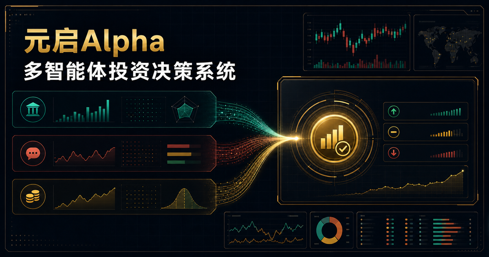

# 元启Alpha · YuanQi Alpha

<div align="center">

**面向金融机构投研与投顾服务场景的多智能体 AI 投研辅助系统**<br>
**A multi-agent AI research assistant for institutional investment research and advisory workflows**

[](https://yuanqi-alpha.vercel.app/)
[](https://github.com/Richard-X-Lion/yuanqi-alpha/releases)
[](https://nextjs.org/)
[](https://react.dev/)
[](./LICENSE)

[在线体验 · Live Demo](https://yuanqi-alpha.vercel.app/) · [功能亮点 · Highlights](#功能亮点--highlights) · [快速开始 · Quick-start](#快速开始--quick-start) · [免责声明 · Disclaimer](#免责声明--disclaimer)

</div>



> **中文：** 在线版本用于产品能力展示和流程体验。系统输出仅用于研究辅助、产品演示、投资者教育或内部服务准备，不构成投资建议、交易指令或收益承诺。
>
> **English:** The online version is provided for product demonstration and workflow evaluation. Its outputs are for research assistance, product demos, investor education, or internal service preparation only. They do not constitute investment advice, trading instructions, or any guarantee of returns.

## 项目简介 · Overview

**中文**

元启Alpha 是一个面向券商、财富管理、投顾服务和投研支持场景的多智能体 AI 投研辅助工作台。系统让三位专业分析师 Agent 独立研判同一标的，再通过主持人引导的多轮辩论完成交叉复核，最终依据辩论后的立场和置信度进行加权表决，并形成可人工确认、可复盘、可留痕的报告草稿。

系统针对不同市场采用不同分析框架：

- **A 股**：基本面、情绪面、资金面
- **港股 / 美股**：Fundamental、Sentiment、Valuation（借鉴 AlphaAgents 的角色分工思想）

**English**

YuanQi Alpha is a multi-agent AI research workspace designed for securities firms, wealth-management teams, investment advisers, and institutional research workflows. Three specialist analyst agents independently examine the same security, cross-review one another through moderator-guided multi-round debates, and cast a confidence-weighted vote based on their post-debate positions. The moderator then produces a reviewable and auditable report draft.

The system applies market-specific analytical frameworks:

- **China A-shares**: Fundamentals, Sentiment, and Capital Flows
- **Hong Kong / U.S. equities**: Fundamental, Sentiment, and Valuation, inspired by the role specialization of AlphaAgents

## 功能亮点 · Highlights

| 中文 | English |
|---|---|
| **市场框架适配**：根据 A 股、港股和美股市场特征启用不同分析角色 | **Market-aware frameworks:** Different analyst roles are activated for A-shares, Hong Kong equities, and U.S. equities |
| **多 Agent 独立分析**：三位分析师分别输出结构化立场、置信度、论据、证据与保留意见 | **Independent multi-agent analysis:** Each analyst produces a structured stance, confidence score, rationale, evidence, and reservations |
| **多轮辩论复核**：分析师读取其他观点与历史发言后重新审视结论；连续三轮无人改变立场才判定为死锁 | **Multi-round cross-review:** Agents reconsider their conclusions after reading peer views and debate history; a deadlock is declared only after three consecutive rounds without a stance change |
| **主持人协调机制**：主持人指出证据冲突、逻辑缺口和关键分歧，但不作为第四位投票者 | **Moderator coordination:** The moderator identifies evidence conflicts, reasoning gaps, and key disagreements without becoming a fourth voter |
| **置信度加权表决**：使用分析师辩论后的最终立场和置信度计算票权，达到 2/3 权重才形成方向性共识 | **Confidence-weighted voting:** Post-debate positions and confidence scores determine voting weight; directional consensus requires a two-thirds threshold |
| **BYOK + BYO MCP**：用户自行配置模型 API 与金融数据 MCP，系统保留数据的 MCP 服务和工具来源 | **BYOK + BYO MCP:** Users provide their own model APIs and financial-data MCP servers, while the system preserves MCP server and tool attribution |
| **过程留痕与导出**：保存完整分析过程，支持历史复盘、统计以及图片、PDF、JSON 导出 | **Audit trail and export:** Complete analysis sessions can be reviewed and exported as images, PDF, or JSON |
| **显式模拟模式**：模型或 MCP 未完整配置时仅运行清晰标记的模拟流程，不伪装成真实市场分析 | **Explicit demo mode:** When model or MCP configuration is incomplete, the system runs a clearly labeled simulation rather than presenting it as live-market analysis |

## 工作流程 · Workflow

```text
选择市场与标的 / Select market and security
                    ↓
读取用户 MCP 数据并保留来源 / Read user-provided MCP data with attribution
                    ↓
三位分析师独立研判 / Three analysts work independently
                    ↓
主持人提示分歧，多轮辩论复核 / Moderator-guided multi-round cross-review
                    ↓
最终观点置信度加权投票 / Confidence-weighted vote on final positions
                    ↓
达到 2/3 共识，或按审慎原则保持 HOLD / Reach 2/3 consensus or default to HOLD
                    ↓
主持人汇总报告并留痕 / Moderator produces an auditable report draft
```

## 分析角色 · Agent Roles

| 市场 / Market | 分析师 1 / Analyst 1 | 分析师 2 / Analyst 2 | 分析师 3 / Analyst 3 |
|---|---|---|---|
| A 股 / China A-shares | 基本面 / Fundamentals | 情绪面 / Sentiment | 资金面 / Capital Flows |
| 港股、美股 / HK & U.S. equities | Fundamental | Sentiment | Valuation |

主持人 Agent 负责组织讨论、核对证据、提示分歧和汇总报告，不参与最终投票。<br>
The moderator agent organizes the discussion, checks evidence, highlights disagreements, and summarizes the report; it does not participate in the final vote.

## 页面与接口 · Pages & APIs

| 路径 / Path | 中文说明 | English Description |
|---|---|---|
| `/` | 分析工作台：市场选择、单股与批量分析、流式过程展示、最终报告 | Research workspace: market selection, single/batch analysis, streamed progress, and final report |
| `/settings` | 配置四个 Agent 的模型 API 与用户 MCP 数据源 | Configure model APIs for four agents and user-provided MCP data sources |
| `/history` | 查看分析记录、结果统计和分析师表现 | Review analysis history, result statistics, and analyst performance |
| `/history/[id]` | 回放完整分析过程并导出报告 | Replay a complete analysis session and export its report |
| `POST /api/analyze` | SSE 流式多智能体分析接口 | SSE endpoint for streaming multi-agent analysis |
| `POST /api/mcp/test` | MCP Server 连接测试接口 | MCP server connectivity test endpoint |

## 技术栈 · Tech Stack

| 层级 / Layer | 技术 / Technology |
|---|---|
| Framework | Next.js 16 · App Router |
| UI | React 19 · Tailwind CSS 4 · shadcn/ui |
| Language | TypeScript 5 · Strict Mode |
| Data Visualization | Recharts |
| Export | html2canvas · jsPDF |
| Model Interface | OpenAI-compatible Chat Completions API |
| Data Source | User-provided MCP servers for non-simulated analysis |

## 快速开始 · Quick Start

### 环境要求 · Prerequisites

- Node.js 20+
- pnpm 9+

### 安装与运行 · Install & Run

```bash
git clone https://github.com/Richard-X-Lion/yuanqi-alpha.git
cd yuanqi-alpha
pnpm install
pnpm dev
```

本地访问 / Open locally: [http://localhost:5000](http://localhost:5000)

### 质量检查 · Quality Checks

```bash
pnpm test
pnpm run validate
pnpm build
```

## 模型配置 · Model Configuration

**中文**

系统采用 BYOK（Bring Your Own Key）模式。进入 `/settings` 后，可分别为三位分析师和主持人配置模型名称、OpenAI 兼容 API Base URL 与 API Key。默认提供商地址仅作为配置起点，模型名称需要使用者根据自己的服务权限填写。

模型 API Key 保存在当前浏览器的 `sessionStorage` 中，服务端不持久化用户密钥。关闭对应浏览器会话后，需要重新填写密钥。

**English**

The application follows a BYOK (Bring Your Own Key) model. On `/settings`, users can configure the model name, OpenAI-compatible API base URL, and API key separately for the three analysts and the moderator. Default provider endpoints are configuration starting points only; model names must match the user's own provider access.

Model API keys are stored in the current browser's `sessionStorage` and are not persisted by the server. Keys must be entered again after the corresponding browser session is closed.

| 角色 / Role | 默认服务方向 / Default Provider Direction |
|---|---|
| 基本面 / Fundamental | DeepSeek-compatible endpoint |
| 情绪面 / Sentiment | Alibaba Cloud Model Studio / DashScope-compatible endpoint |
| 资金面 / Valuation | DeepSeek-compatible endpoint |
| 主持人 / Moderator | Volcengine-compatible endpoint |

## MCP 数据源 · MCP Data Sources

**中文**

非模拟分析必须通过 Model Context Protocol 接入用户自己的金融数据源。平台仅执行 HTTPS、公网地址与连接安全检查，并为每项数据保留 MCP 服务名和工具名。平台本身不提供或背书真实行情、新闻、财报、研报或公告。

当前自动适配方向包括：

- `FinGeneralQuery`：综合金融数据查询
- `MacroIndustryData`：宏观与行业数据
- `FinancialResearchReport`：券商研报检索
- `AnnouncementData`：上市公司公告检索

未配置完整模型或可用 MCP 时，系统仅运行明确标记的模拟模式。若 MCP token 包含在 URL 中，该 URL 会保存在当前浏览器配置中；使用者应自行确认数据授权、频率限制、服务条款和 token 保护方案。

**English**

Non-simulated analysis requires users to connect their own financial-data services through the Model Context Protocol. The platform performs HTTPS, public-address, and connection-safety checks, and retains the MCP server and tool name for every evidence item. The platform itself neither provides nor endorses live market data, news, financial statements, research reports, or corporate announcements.

Currently recognized tool directions include:

- `FinGeneralQuery`: general financial-data queries
- `MacroIndustryData`: macroeconomic and industry data
- `FinancialResearchReport`: brokerage research retrieval
- `AnnouncementData`: listed-company announcement retrieval

If the model or MCP setup is incomplete, only the explicitly labeled simulation mode is available. When an MCP token is embedded in a URL, that URL is stored in the current browser configuration. Users are responsible for data licensing, rate limits, service terms, and token protection.

## 部署 · Deployment

项目包含 `vercel.json`，可作为 Next.js 应用部署至 Vercel。<br>
The repository includes `vercel.json` for deployment as a Next.js application on Vercel.

```bash
pnpm next build
```

Fork 或自行部署时，请通过托管平台控制台设置环境变量，不要把 `.env.local`、`.npmrc`、平台部署元数据或 API Key 提交到仓库。<br>
When forking or self-hosting, configure environment variables through the hosting platform. Never commit `.env.local`, `.npmrc`, provider deployment metadata, or API keys.

| 环境变量 / Variable | 中文说明 | English Description |
|---|---|---|
| `UPSTASH_REDIS_REST_URL` | 生产环境分布式限流 Redis REST 地址 | Redis REST URL for distributed production rate limiting |
| `UPSTASH_REDIS_REST_TOKEN` | 生产环境分布式限流 Token | Redis REST token for distributed production rate limiting |
| `TRUSTED_CLIENT_IP_HEADER` | 可信客户端 IP Header，默认 `x-forwarded-for` | Trusted client IP header; defaults to `x-forwarded-for` |
| `ALLOW_IN_MEMORY_RATE_LIMIT` | 单实例演示环境可设为 `true` | May be set to `true` for a single-instance demo environment |

> **部署提示 / Deployment note:** Vercel Hobby 对函数执行时长存在限制。完整的多 Agent 分析和辩论在真实模型响应较慢时，可能需要更高的执行时长或独立的后台任务队列。<br>
> Vercel Hobby limits function execution time. Full multi-agent analysis and debate may require a longer execution window or a separate background job queue when upstream models respond slowly.

## 模拟模式 · Simulation Mode

**中文：** 模拟模式用于产品展示与流程验证，其中的行情、财务、新闻和目标价格均为明确标记的演示数据，不得用于真实投资判断。真实分析要求所有必要模型配置完整，并且用户 MCP 成功返回至少一项带来源的数据。

**English:** Simulation mode is intended for product demonstration and workflow validation. Its prices, financial figures, news, and target prices are explicitly labeled sample data and must not be used for real investment decisions. Non-simulated analysis requires all necessary model configurations and at least one attributed evidence item returned by the user's MCP service.

## 安全与合规 · Security & Compliance

- 用户需自行确认 MCP 数据授权、频率限制和服务条款。<br>
  Users are responsible for MCP data licensing, rate limits, and service terms.
- 对外演示前应对 API Key、MCP token、客户信息与日志进行脱敏。<br>
  API keys, MCP tokens, client information, and logs must be redacted before external demonstrations.
- 模型输出应进入人工确认和机构合规审核流程。<br>
  Model outputs should be subject to human confirmation and institutional compliance review.
- 正式公网部署应使用分布式限流、日志保护和安全监控。<br>
  Public production deployments should use distributed rate limiting, protected logs, and security monitoring.

## 参与贡献 · Contributing

欢迎提交 Issue、功能建议和 Pull Request。请先阅读[贡献指南](./CONTRIBUTING.md)、[安全政策](./SECURITY.md)和[更新日志](./CHANGELOG.md)。提交代码前请运行：<br>
Issues, feature proposals, and pull requests are welcome. Please read the [contribution guide](./CONTRIBUTING.md), [security policy](./SECURITY.md), and [changelog](./CHANGELOG.md) first. Before submitting code, run:

```bash
pnpm test
pnpm run validate
```

请勿在 Issue、日志、截图或提交记录中公开任何 API Key、MCP token 或真实客户数据。<br>
Do not expose API keys, MCP tokens, or real client data in issues, logs, screenshots, or commits.

## 免责声明 · Disclaimer

**中文**

本项目及其输出仅用于研究辅助、技术验证、产品演示、投资者教育或金融机构内部服务准备，不构成任何形式的投资建议、交易指令、收益承诺、自动投资决策或代客理财服务。使用者应结合适用法律法规、机构合规要求、客户适当性要求和人工复核流程审慎使用。

**English**

This project and its outputs are intended solely for research assistance, technical evaluation, product demonstration, investor education, or internal preparation by financial institutions. They do not constitute investment advice, trading instructions, performance guarantees, automated investment decisions, or discretionary asset-management services. Users must apply all relevant laws, institutional compliance requirements, client-suitability obligations, and human-review procedures.

## 开源许可 · License

本项目基于 [Apache License 2.0](./LICENSE) 开源。<br>
This project is open-sourced under the [Apache License 2.0](./LICENSE).

---

<div align="center">

如果这个项目对你有帮助，欢迎 Star、Fork 或参与讨论。<br>
If you find this project useful, feel free to Star, Fork, or join the discussion.

</div>
